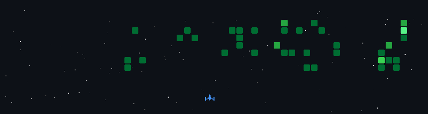

  

  

$\color{#55ffff}{\text{𝑨𝑰 , 𝑪𝒚𝒃𝒆𝒓𝒔𝒆𝒄𝒖𝒓𝒊𝒕𝒚 𝑬𝒏𝒕𝒉𝒖𝒔𝒊𝒂𝒔𝒕 | 𝑳𝒆𝒂𝒓𝒏𝒊𝒏𝒈 𝑪𝒍𝒐𝒖𝒅 𝑨𝒓𝒄𝒉𝒊𝒕𝒆𝒄𝒕𝒖𝒓𝒆 𝒂𝒏𝒅 𝑺𝒆𝒄𝒖𝒓𝒊𝒕𝒚 𝑷𝒓𝒐𝒇𝒆𝒔𝒔𝒊𝒐𝒏𝒂𝒍 }}$

 

  
$\color{#55ffff}{\text{𝑾𝒐𝒓𝒌𝒊𝒏𝒈 𝒕𝒐𝒘𝒂𝒓𝒅𝒔 𝒃𝒖𝒊𝒍𝒅𝒊𝒏𝒈 𝒔𝒆𝒄𝒖𝒓𝒆 𝒂𝒏𝒅 𝒊𝒏𝒕𝒆𝒍𝒍𝒊𝒈𝒆𝒏𝒕 𝒔𝒐𝒍𝒖𝒕𝒊𝒐𝒏𝒔}}$

<!--securityknightocat image-->

𝐈 𝐚𝐦 𝐚 𝐩𝐚𝐬𝐬𝐢𝐨𝐧𝐚𝐭𝐞 𝐈𝐓 𝐮𝐧𝐝𝐞𝐫𝐠𝐫𝐚𝐝𝐮𝐚𝐭𝐞 𝐝𝐞𝐝𝐢𝐜𝐚𝐭𝐞𝐝 𝐭𝐨 𝐟𝐮𝐥𝐥-𝐬𝐭𝐚𝐜𝐤 𝐝𝐞𝐯𝐞𝐥𝐨𝐩𝐦𝐞𝐧𝐭, 𝐜𝐥𝐨𝐮𝐝 𝐢𝐧𝐟𝐫𝐚𝐬𝐭𝐫𝐮𝐜𝐭𝐮𝐫𝐞, 𝐚𝐧𝐝 𝐢𝐧𝐭𝐞𝐥𝐥𝐢𝐠𝐞𝐧𝐭 𝐬𝐲𝐬𝐭𝐞𝐦𝐬. 𝐈 𝐞𝐧𝐣𝐨𝐲 𝐭𝐮𝐫𝐧𝐢𝐧𝐠 𝐜𝐨𝐦𝐩𝐥𝐞𝐱 𝐩𝐫𝐨𝐛𝐥𝐞𝐦𝐬 𝐢𝐧𝐭𝐨 𝐬𝐞𝐜𝐮𝐫𝐞, 𝐫𝐞𝐚𝐥-𝐰𝐨𝐫𝐥𝐝 𝐭𝐞𝐜𝐡𝐧𝐢𝐜𝐚𝐥 𝐬𝐨𝐥𝐮𝐭𝐢𝐨𝐧𝐬.

- I'm 23 years old. 
- 🌱 Currently pursuing a BSc in Information Technology at 𝑻𝒉𝒆 𝑶𝒑𝒆𝒏 𝑼𝒏𝒊𝒗𝒆𝒓𝒔𝒊𝒕𝒚 𝒐𝒇 𝑺𝒓𝒊 𝑳𝒂𝒏𝒌𝒂. 
- ☁️ Deeply interested in 𝐂𝐥𝐨𝐮𝐝 𝐀𝐫𝐜𝐡𝐢𝐭𝐞𝐜𝐭𝐮𝐫𝐞 (𝐀𝐖𝐒 & 𝐀𝐳𝐮𝐫𝐞), 𝐂𝐲𝐛𝐞𝐫𝐬𝐞𝐜𝐮𝐫𝐢𝐭𝐲, & 𝐀𝐫𝐭𝐢𝐟𝐢𝐜𝐢𝐚𝐥 𝐈𝐧𝐭𝐞𝐥𝐥𝐢𝐠𝐞𝐧𝐜𝐞  
- 🔭 I’m currently working on full-stack web apps & AI/ML projects 
- 👯 Looking to collaborate on open-source AI projects, cloud-native apps, or cybersecurity tools 

---
 

    

<h2 align="center">$\color{#c5ff4a}{\text{Tᴇᴄʜ sᴛᴀᴄᴋ}}$ </h2> 
<picture>
  <source media="(prefers-color-scheme: dark)" srcset="./Skills_Animation_Dark.gif">
  <source media="(prefers-color-scheme: light)" srcset="./Skills_Animation_White.gif">
  
</picture>
 

<h3 align="left">Current Learning</h3>
<ul align="left">
<li>- 🧠 Deepening my knowledge in 𝑨𝒓𝒕𝒊𝒇𝒊𝒄𝒊𝒂𝒍 𝑰𝒏𝒕𝒆𝒍𝒍𝒊𝒈𝒆𝒏𝒄𝒆 and 𝑪𝒚𝒃𝒆𝒓𝒔𝒆𝒄𝒖𝒓𝒊𝒕𝒚.</li> 
<li>- 🐍 Expanding my skills in 𝒅𝒂𝒕𝒂 𝒎𝒂𝒏𝒊𝒑𝒖𝒍𝒂𝒕𝒊𝒐𝒏, 𝒘𝒆𝒃 𝒔𝒄𝒓𝒂𝒑𝒊𝒏𝒈, and 𝒂𝒖𝒕𝒐𝒎𝒂𝒕𝒊𝒐𝒏 𝒖𝒔𝒊𝒏𝒈 𝑷𝒚𝒕𝒉𝒐𝒏.</li> 
<li>- ☁️ Exploring cloud computing platforms and certification pathways for AWS and Microsoft Azure.</li> 
</ul>

  

